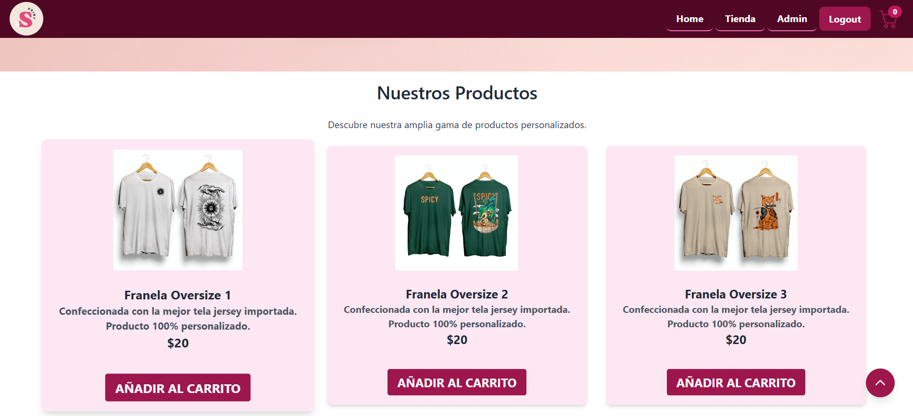
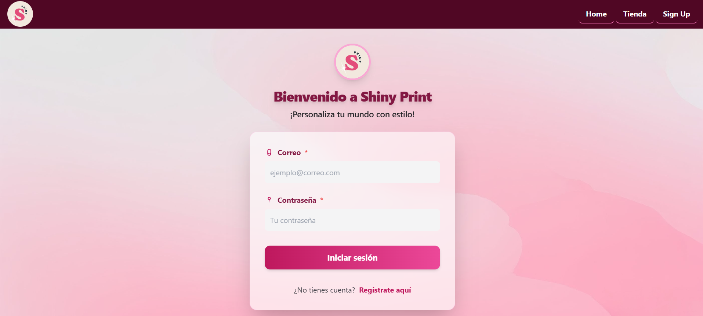
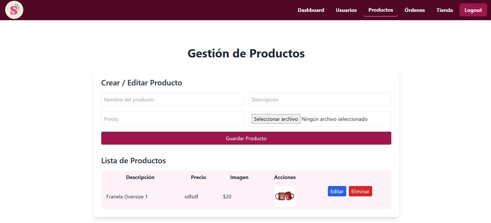
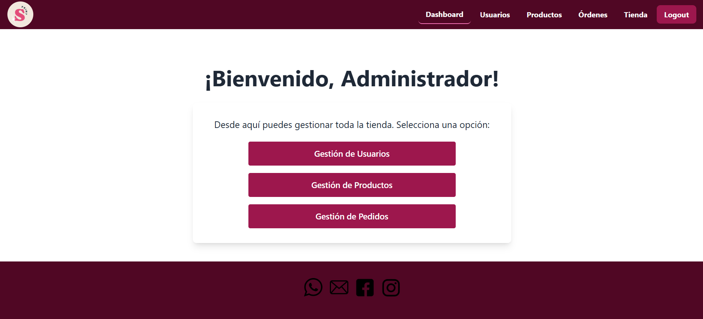

# Tienda Shiny Print

Tienda Shiny Print es una aplicación web de e-commerce para la venta de productos personalizados como tazas, camisetas y coolers.

## Tecnologías utilizadas

- **Node.js** y **Express** (Backend)
- **MongoDB** con **Mongoose** (Base de datos)
- **Tailwind CSS** (Estilos)
- **JavaScript** (Frontend y Backend)
- **HTML** (Vistas)
- **CSS** (Estilos personalizados)
- **Multer** (Subida de archivos)
- **JWT** (Autenticación)
- **Bcrypt** (Hash de contraseñas)
- **Nodemailer** (Envío de correos)
- **Morgan** (Logs)
- **Dotenv** (Variables de entorno)
- **Cookie-parser** y **CORS** (Cookies y políticas de origen cruzado)
- **Nodemon** y **cross-env** (Desarrollo)

## Estructura del proyecto

```
app.js
config.js
index.js
input.css
package.json
tailwind.config.js
/controllers
/models
/middleware
/views
/img
/uploads
```

## Instalación

1. Clona el repositorio.
2. Instala las dependencias:
   ```
   npm install
   ```
3. Configura las variables de entorno en un archivo `.env`.
4. Inicia el servidor en modo desarrollo:
   ```
   npm run dev
   ```

## Uso

Accede a la aplicación desde tu navegador en `http://localhost:3000` (o el puerto configurado).

## Capturas de las vistas principales

### Vista Home


### Vista Tienda


### Vista Login


### Vista Producto


### Vista Admin

